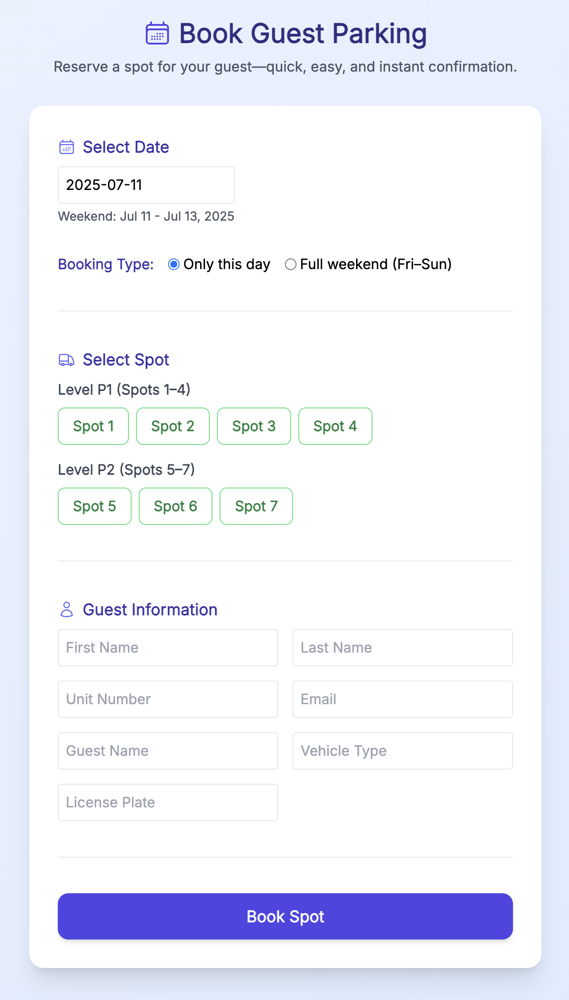
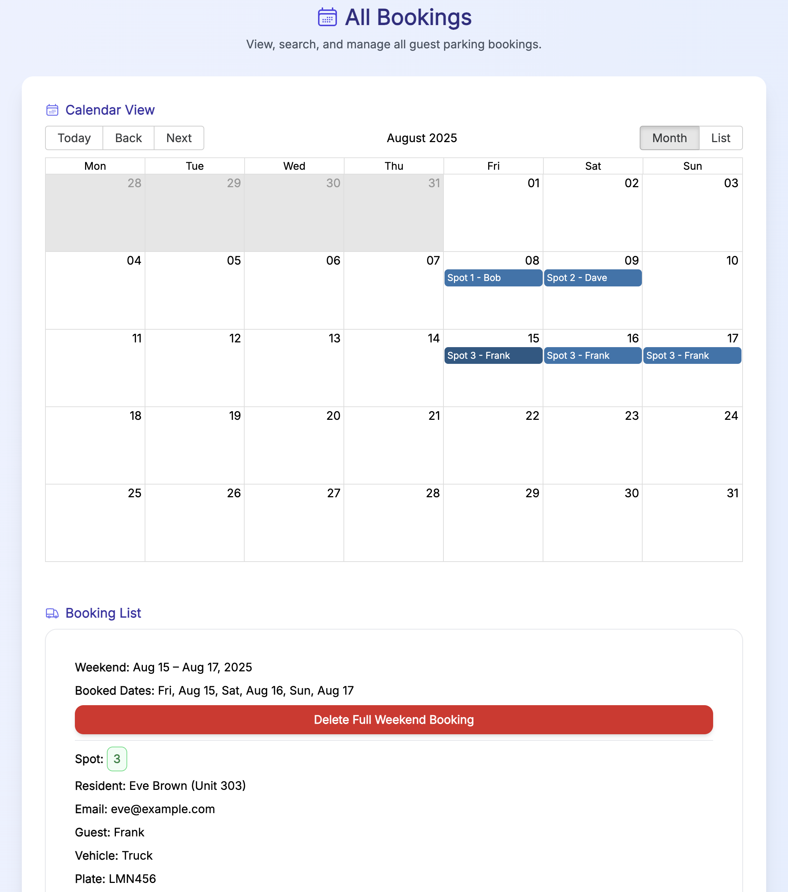

# 🚗 Guest Parking App

A full-stack web app that allows condo residents to book guest parking spots for weekends, with a clean admin interface, email confirmations, and AWS-powered infrastructure.

## 📁 Project Structure

```
guest-parking/
├── frontend/      # Vite + React app (deployed to Amplify)
├── backend/       # Express API (deployed to AWS Lambda)
├── infra/         # Terraform IaC for backend infrastructure
├── screenshots/   # I mean I *hope* this folder is pretty self-explanatory
└── .github/       # GitHub Actions CI/CD workflows
```

## 🌐 Frontend

- Built with [Vite](https://vitejs.dev/) + [React](https://react.dev/)
- Deployed via [AWS Amplify](https://aws.amazon.com/amplify/)
- Uses `react-hot-toast`, `clsx`, `tailwindcss`, and `react-datepicker`

### Features

✅ Book parking spots for upcoming weekends  
✅ View available spots dynamically  
✅ Email confirmations for users  
✅ Admin view with delete capability and calendar view  
✅ Bookings grouped by weekend  
✅ Past bookings hidden by default  
✅ CORS-safe, responsive, and toast-notified!

## 🛠️ Backend

- Built with [Express](https://expressjs.com/)
- Runs on [AWS Lambda](https://aws.amazon.com/lambda/)
- Uses [Supabase](https://supabase.com/) for PostgreSQL
- Email sending powered by [Resend](https://resend.com/)

### API Endpoints

| Method | Endpoint                     | Description                         |
|--------|------------------------------|-------------------------------------|
| GET    | `/api/bookings`              | Get all bookings (admin)            |
| GET    | `/api/bookings/availability` | Check available spots for a weekend |
| POST   | `/api/bookings`              | Create a new booking                |
| DELETE | `/api/bookings/:id`          | Delete a booking (admin only)       |

## ☁️ Infrastructure

- Managed with [Terraform](https://www.terraform.io/)
- Uses:
  - AWS Lambda for backend
  - AWS S3 for Lambda deployment package
  - Supabase PostgreSQL as the database

### Setup

```bash
cd infra
terraform init
terraform apply
```

⚠️ **Never commit secrets.** Use `terraform.tfvars.example` and `.env.example` as templates.

## 🚀 Deployments

### Frontend: Amplify

- Triggered on changes to `/frontend`
- Controlled by `amplify.yml` at the repo root

### Backend: GitHub Actions

- On push to `/backend`, deploys zip to AWS Lambda via `deploy-backend.yml`

## 🔐 Environment Variables

### Frontend

Set via Amplify (must use `VITE_` prefix):

```bash
VITE_REACT_APP_BACKEND_URL=https://<your-api-id>.execute-api.us-east-1.amazonaws.com
VITE_REACT_APP_ADMIN_PASSWORD=your_admin_password
```

### Backend

Handled via GitHub Actions & Terraform:

```bash
DATABASE_URL=postgresql://...
RESEND_API_KEY=re_XXXX
FROM_EMAIL=admin@example.com
ALLOWED_ORIGINS=https://main.<your-app>.amplifyapp.com
```

## 📸 Screenshots

### Booking page


### Confirmation email


### Administration


## 🧪 Local Development

```bash
# Frontend
cd frontend
npm install
npm run dev

# Backend
cd backend
npm install
node index.js
```

## 🤝 Contributing

1. Fork this repo
2. Create your feature branch (`git checkout -b feature/thing`)
3. Commit your changes (`git commit -am 'Add thing'`)
4. Push to the branch (`git push origin feature/thing`)
5. Create a new Pull Request

## ⚠️ Security Notes

If using Supabase:
- Enable Row Level Security (RLS)
- Restrict public access where possible
- NEVER commit your `.env` or secrets — use `.env.example` templates

## 📬 Contact

Built with ❤️, hot-reloading, and a _lot_ of `console.log()` commands by [Scott Kosman](https://scottkosman.com)  
Got questions or want to contribute? Open an issue or reach out!
